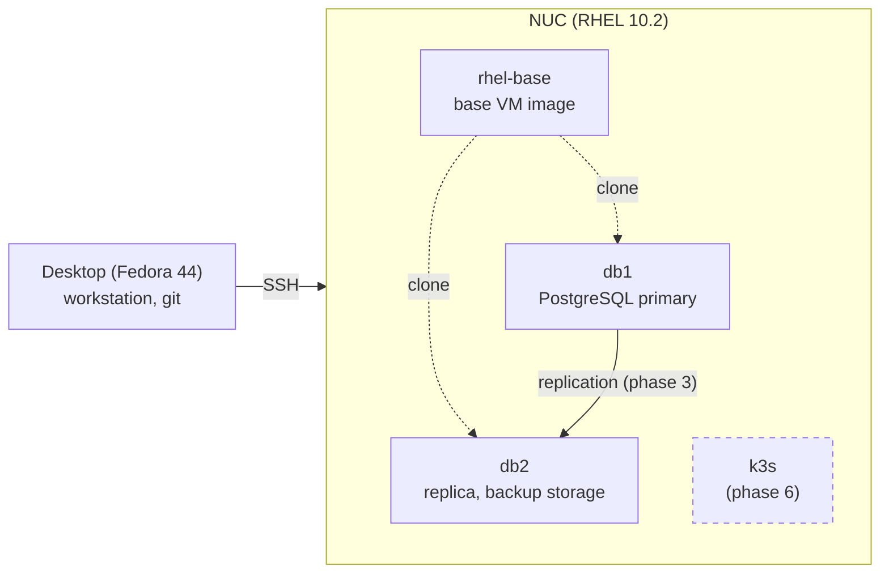

# rhel-data-platform

A learning project. I build a small PostgreSQL setup on Red Hat Enterprise Linux 10 in a home lab. I do each step by hand first, then automate it.

What I learn here:

- **RHEL 10 administration** (RHCSA / EX200 topics): storage, SELinux, firewall, systemd, networking and backups, all on a database server.
- **PostgreSQL administration**: install, storage layout, replication, backups and a small ETL job.
- **Automation and containers**: rebuild the lab with Ansible, run it with Podman, then move it to Kubernetes (k3s).

## Lab

Dashed boxes are planned. Details: [docs/architecture.md](docs/architecture.md)

## Roadmap

| # | Phase | Status |
|---|---|---|
| 0 | Lab: install the NUC with kickstart, KVM, base VM, db1/db2 | done |
| 1 | PostgreSQL by hand: LVM, XFS, SELinux, firewall, timers, NFS | in progress |
| 2 | RHCSA practice exam | planned |
| 3 | Replication and a small ETL job | planned |
| 4 | Ansible: rebuild the lab as code | planned |
| 5 | Containers: Podman | planned |
| 6 | Kubernetes: k3s + CloudNativePG | planned |

Full list: [docs/roadmap.md](docs/roadmap.md). Session notes: [docs/journal/](docs/journal/).
